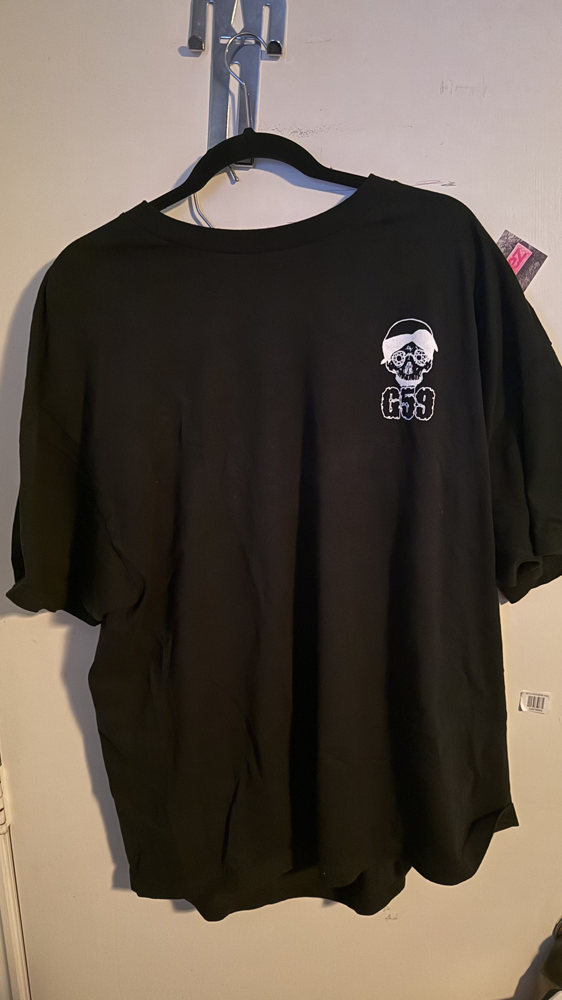
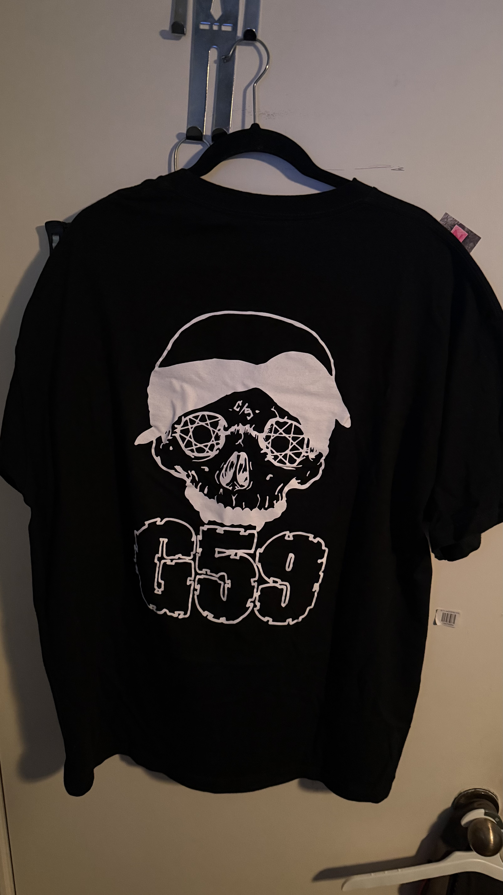

# JuanPiVi0706.github.io
This is Project for The University Of North Texas a Archive to show G59 merchandise throw out the years
---
layout: default
title: Artist Merchandise Repository
---

# Artist Merchandise Repository

## About This Repository
This repository documents and preserves artist merchandise over time in a structured and searchable way. The purpose of this project is to organize merchandise items by era, tour, album, or collection while also recording important details such as release year, item type, price, and source. This project was created to provide a more complete and in-depth record of artist merchandise, especially for items that may no longer be sold or are missing from existing fan-made archives.

## Why I Chose GitHub Pages
I chose **GitHub Pages** for this project because it is free, public, easy to customize, and works well for a visual online repository. Since this project focuses on artist merchandise over time, GitHub Pages allows me to present images, descriptions, and item details in a chronological and organized way. It also gives me a public URL, which makes the repository easy to share and access.

## User Group
The main users of this repository are:
- fans of the artist
- merchandise collectors
- researchers interested in music and fan culture
- people looking for information about past merchandise releases

## Information Need
Users may want to:
- identify merchandise from a specific era or tour
- compare items across years
- find images of older merchandise
- learn item details such as release period, type, and price
- preserve information about merchandise that is no longer available

## Repository Structure
This repository is organized into **two levels**:

### Level 1: Main Collection
- Artist Merchandise Archive

### Level 2: Sub-Collections
- Tour Merchandise
- Album / Era Merchandise

---

# Tour Merchandise

## Item 1: [Item Name]

| Field | Metadata |
|---|---|
| Title | [Item Name] |
| Artist | [Artist Name] |
| Year | [Year] |
| Collection / Tour | [Tour Name] |
| Item Type | [Hoodie, T-Shirt, Hat, Poster, etc.] |
| Color / Variant | [Color or version] |
| Original Price | [Price if known] |
| Description | [Short description of the item] |
| Source | [Official store, archived page, fan photo, resale listing, etc.] |
| Rights / Notes | [State source and any copyright or usage notes] |

## Item 2: [Item Name]

| Field | Metadata |
|---|---|
| Title | [Item Name] |
| Artist | [Artist Name] |
| Year | [Year] |
| Collection / Tour | [Tour Name] |
| Item Type | [Hoodie, T-Shirt, Hat, Poster, etc.] |
| Color / Variant | [Color or version] |
| Original Price | [Price if known] |
| Description | [Short description of the item] |
| Source | [Official store, archived page, fan photo, resale listing, etc.] |
| Rights / Notes | [State source and any copyright or usage notes] |

## Item 3: [Item Name]

| Field | Metadata |
|---|---|
| Title | [Item Name] |
| Artist | [Artist Name] |
| Year | [Year] |
| Collection / Tour | [Tour Name] |
| Item Type | [Hoodie, T-Shirt, Hat, Poster, etc.] |
| Color / Variant | [Color or version] |
| Original Price | [Price if known] |
| Description | [Short description of the item] |
| Source | [Official store, archived page, fan photo, resale listing, etc.] |
| Rights / Notes | [State source and any copyright or usage notes] |

---

# Album / Era Merchandise

## Item 4: [Item Name]

| Field | Metadata |
|---|---|
| Title | [Item Name] |
| Artist | [Artist Name] |
| Year | [Year] |
| Collection / Era | [Album or era name] |
| Item Type | [Hoodie, T-Shirt, Hat, Poster, etc.] |
| Color / Variant | [Color or version] |
| Original Price | [Price if known] |
| Description | [Short description of the item] |
| Source | [Official store, archived page, fan photo, resale listing, etc.] |
| Rights / Notes | [State source and any copyright or usage notes] |

## Item 5: [Item Name]

| Field | Metadata |
|---|---|
| Title | [Item Name] |
| Artist | [Artist Name] |
| Year | [Year] |
| Collection / Era | [Album or era name] |
| Item Type | [Hoodie, T-Shirt, Hat, Poster, etc.] |
| Color / Variant | [Color or version] |
| Original Price | [Price if known] |
| Description | [Short description of the item] |
| Source | [Official store, archived page, fan photo, resale listing, etc.] |
| Rights / Notes | [State source and any copyright or usage notes] |

---

## Collection Policy
This repository focuses on documenting artist merchandise in a chronological and organized way. Items are included based on relevance to the artist’s official merchandise history, available visual evidence, and the ability to provide basic identifying metadata. When exact information is unknown, the item record will note that the information is approximate or currently unavailable.

## Rights Statement
This repository is intended for educational and archival purposes. Images and item information are credited to their original sources when known. Merchandise images may remain under copyright of the artist, label, brand, photographer, or original seller.

## Conclusion
This repository helps preserve and organize artist merchandise history by providing structured metadata, images, and categories that make the collection easier to browse and understand.
